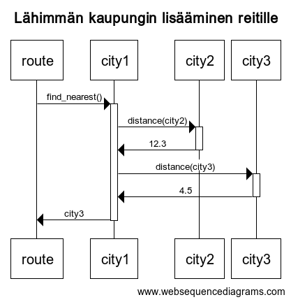

# Arkkitehtuurikuvaus

## Rakenne

Sovelluksen rakenne noudattaa kolmitasoista kerrosarkkitehtuuria. Koodin pakkausrakenne on kuvattu alla.

Pakkaus UI sisältää käyttöliittymään liittyvän koodin, solver-pakkaus sisältää ratkaisualgoritmin kauppamatkustajan ongelmalle ja sekä siihen olennaisesti liittyvää koodia, city-pakkaus sisältää yksittäisiä kaupunkeja koskevan koodin sekä etäisyyksien vertailufunktion ja fileio-pakkaus sisältää syöttö- ja tulostiedoston käsittelyä koskevan koodin. Pakkaus build sisältää syöttötiedon rakennussovellukseen liittyvän koodin ja on itsenäinen muista pakkauksista.

## Käyttöliittymä

Syöttötiedoston rakennussovelluksella ja ratkaisinsovelluksella on omat käyttöliittymänsä. Ratkaisinsovelluksen käyttöliittymä on pyritty eristämään sovelluslogiikasta parhaan mukaan.

## Sovelluslogiikka

Sovelluslogiikka rakentuu luokkien City, Route, File\_reader ja Output\_handler varaan. File\_reader ja Output\_handler ovat tiedostojen käsittelyyn liittyviä luokkia; File\_reader lukee kaupunkien koordinaatit datatiedostosta (kansiosta "/data/"") ja luo niistä listan City-luokan olioita. Output\_handler kirjoittaa tulostiedostot "/results/"-kansioon. Luokka Route saa argumentiksiin listan City-luokan olioita. Route-luokan metodi "solve()" ratkaisee approksimoidun ratkaisun kauppamatkustajan ongelmaan. Luokkien väliset riippuvuudet on kuvailtuna alla olevassa luokkakaaviossa.

## Tietojen pysyväistallennus

Pakkauksen "fileio" luokat "File\_reader" ja "Output\_handler" käsittelevät tiedostoja. "File\_reader"-luokka lukee syöttötiedoston. "Output\_handler"-luokka luo ratkaistusta reitista graafin ja tallentaa reitin tiedostoon.

## Päätoiminnallisuus

Ratkaisinsovellus laskee approksimoidun ratkaisun kauppamatkustajan ongelmaa lähimmän naapurin algoritmilla. Alla oleva sekvenssikaavio kuvaa nykyistä kaupunkia (city1) lähimpänä olevan kaupungin lisäämistä reitille seuraavaksi.

## Ohjelman rakenteeseen jääneet heikkoudet

Sovellus on tarkoitettu lähinnä pienien ongelmien ratkaisuun, eikä käyttäjälle ei anneta tietoa laskennan etenemisestä. Toinen merkittävä ongelma on, että lähimmän naapurin antaa harvoin optimaalisen reitin.
