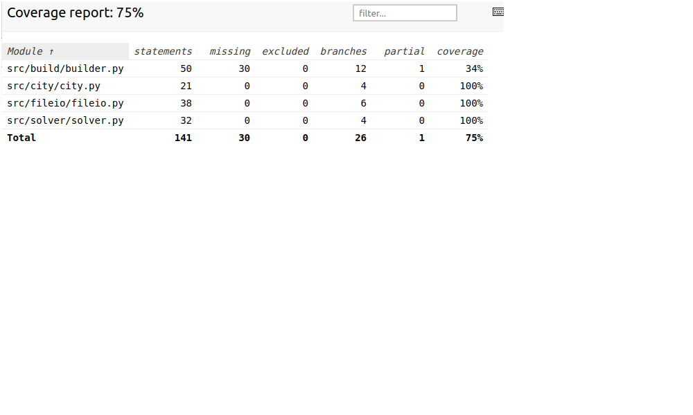

# Testausdokumentti

Ohjelman toimivuutta on testattu unittestin automatisoiduin yksikkö- ja integraatiotestein sekä manuaalisesti.

## Yksikkö- ja integraatiotestaus

Sovelluslogiikan kannalta olennaisia City- ja Route-luokkia city\_test- ja route\_test-testiluokilla. Molemmat testit alustetaan luomalla muutamia City-luokan olioita, joita tarvitaan itse testien tekemiseen.

### Tiedostonkäsittelyn testaus

Tiedostonkäsittelyä hoitavien luokkien File\_reader- ja Output\_handler-luokkia testataan TestFile\_reader- ja TestOutput\_handler-testiluokilla. Näiden luokkien testaamista varten testikansiossa on alikansiona [testfiles-kansio](https://github.com/mikkope123/ot-harjoitustyo/tree/master/src/tests/testfiles), jossa on [testitiedosto](https://github.com/mikkope123/ot-harjoitustyo/blob/master/src/tests/testfiles/test_data.txt) syöttötiedoston lukemisen testaamiseen. Lisäksi tulostiedostojen luomisalgoritmien testit luovat tulostiedostonsa tähän kansioon (tiedostot testimage.png ja testresults).

### Syöttösovelluksen testaus

Syöttösovelluksen luokan build testauksesta vastaa TestFile\_builder-luokka. Luokan testaamisessa on keskitetty manuaaliseen testaamisen, sillä luokka tukeutuu syvästi käyttäjän syötteisiin, jolloin automatisoitujen testien luominen on haastavaa.

### Testauskattavauus

Testauskattavuus on käyttöliittymään liittyvän koodin tarkastelusta poisjättämisen jälkeen 75%.

Testauksen suurimmat puutteet liittyvät syöttösovelluksen TestFile\_builder-luokkaan, jota testattiin pääasiassa manuaalisesti.

## Järjestelmätestaus

Järjestelmätestaus on suoritettu manuaalisesti.

### Asennus ja konfigurointi

Sovellusta on testattu Linux-käyttöjärjestelmässä. Ratkaisinsovellusta on testattu muutamilla eri syöttötiedostoilla, tarkistaen, että tulostus terminaaliin sekä tulostiedostot ovat kunnossa, eikä toiminnallisuudessa esiinny kummallisuuksia.

Syöttösovellusta testattiin erilaisin sekä sallituin että virheellisin syöttein. Lisäksi testattiin, että luotu syöttötiedosto on muotoilultaan oikean mallinen ja että ratkaisinsovellus ymmärtää syöttösovelluksen luoman tiedoston.

## Sovellukseen jääneet laatuongelmat

Sovelluksen laatuongelmia ovat:
 - Sovelluksen vaatima syöttötiedoston muoto ei välttämättä ole järkevin mahdollinen.
 - Käyttäjällä ei ole mahdollisuutta nimetä syöttö- tai tulostiedostoja
 - Jos tuloskansioon ei ole kirjoitusoikeutta, ohjelma luultavasti kaatuu. Tätä ei ole testattu.
 - Sovellus antaa usein optimaalista huonomman ratkaisun reitille, johtuen käytetyn ratkaisualgoritmin heikkouksista.
